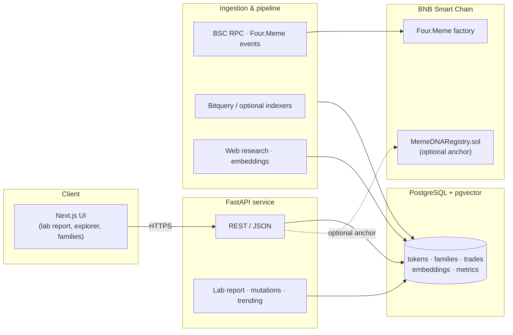
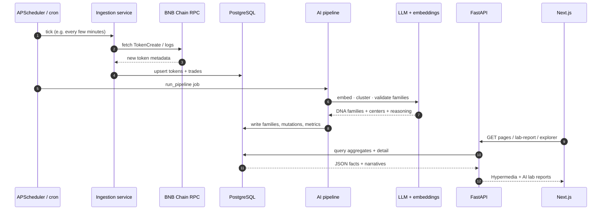

# MemeLab

<p align="center">
  DNA intelligence · Four.Meme on BNB Chain · AI clustering · Next.js + FastAPI
</p>

<p align="center">
  <a href="LICENSE"></a>
  
  
  
  
  
</p>

<p align="center">
  <a href="#documentation">Documentation</a> ·
  <a href="#architecture-high-level">Architecture</a> ·
  <a href="#core-runtime-flow">Runtime flow</a> ·
  <a href="#quickstart">Quickstart</a> ·
  <a href="#repository-layout">Layout</a>
</p>

---

## Documentation

- **In-app docs:** run the frontend and open `/docs` (MemeLab documentation hub).
- **Deep dives:** [`docs/ARCHITECTURE.md`](docs/ARCHITECTURE.md) · [`docs/API.md`](docs/API.md) · [`docs/DEPLOYMENT.md`](docs/DEPLOYMENT.md) · [`docs/AI_PROMPTS.md`](docs/AI_PROMPTS.md)
- **Repository:** [github.com/nrlartt/memelab](https://github.com/nrlartt/memelab)

---

MemeLab turns chaotic **Four.Meme** launches on **BNB Chain** into structured **DNA Families** (real-world event clusters), with embeddings, LLM validation, web research enrichment, trading analytics, and an optional on-chain registry anchor.

| Real-world idea | DNA model |
| ---------------- | --------- |
| Event / narrative cluster | **DNA Family** |
| One token | **Mutation** |
| First token in family | **Origin Strain** |
| Strongest market footprint | **Dominant Strain** |
| Fastest-moving mutant | **Fastest Mutation** |

---

## Architecture (high level)

System boundaries: ingestion from chain and vendors → PostgreSQL (+ pgvector) → AI batch pipeline → FastAPI → Next.js UI; optional smart-contract anchoring on BSC.



For database schema detail and pipeline stages, see [`docs/ARCHITECTURE.md`](docs/ARCHITECTURE.md).

---

## Core runtime flow

End-to-end path from new on-chain activity to UI-ready DNA artifacts: scheduled ingest → persist → AI pipeline batches → analytics strains → REST → clients.



---

## Quickstart

```bash
cp .env.example .env
# Set OPENAI_API_KEY, BSC_RPC_URL, DATABASE_URL, etc.

docker compose up -d postgres
docker compose run --rm api python -m scripts.bootstrap_db
docker compose run --rm api python -m scripts.run_ingest --since-hours 24
docker compose run --rm api python -m scripts.run_pipeline
docker compose up api
# API: http://localhost:8000/docs

cd frontend && npm install && npm run dev
# UI: http://localhost:3000
```

Full production notes: [`docs/DEPLOYMENT.md`](docs/DEPLOYMENT.md).

---

## Repository layout

```
├── frontend/           # Next.js 15 · MemeLab UI
├── src/memedna/       # FastAPI app, ingestion, AI, pipeline
├── contracts/         # Solidity registry (Hardhat)
├── sql/              # Postgres bootstrap
├── docs/             # Architecture, API, deployment
├── scripts/          # CLI entrypoints
└── docker-compose.yml
```

---

## API snapshot

| Method | Path | Description |
| ------ | ---- | ----------- |
| GET | `/dna-families` | Paginated DNA families |
| GET | `/dna-family/{id}` | Family detail + strains |
| GET | `/mutation/{token}` | Token as mutation |
| POST | `/lab-report` | AI one-page lab report |

Complete list: [`docs/API.md`](docs/API.md).

---

## License

MIT — see [`LICENSE`](LICENSE).
